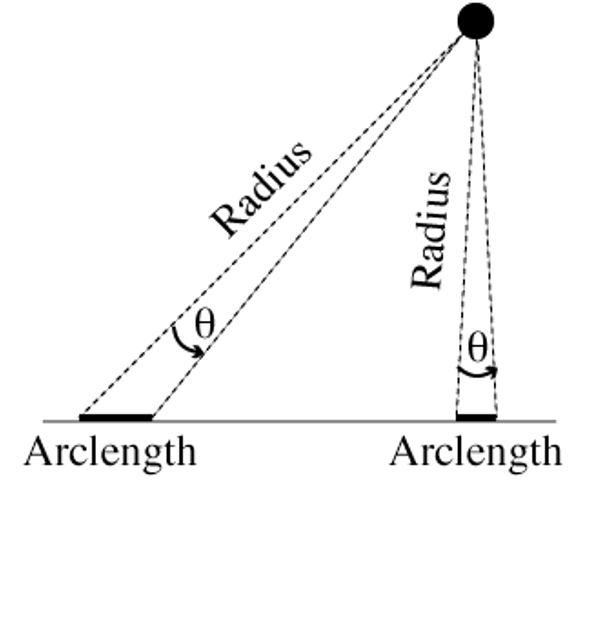
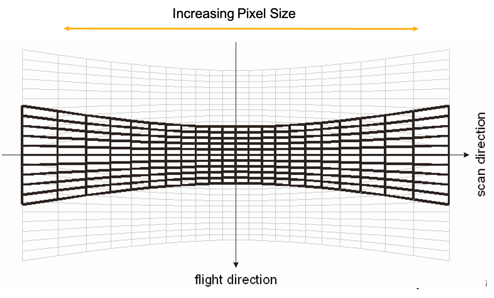

```{r setup, include=FALSE}
knitr::opts_chunk$set(fig.width=6, fig.asp = 0.618, collapse=TRUE) 
```

### Unit 5: Spatial
#### Lesson 1: bathymetry and chlorophyll rasters
#### New packages: raster, mapdata, marmap
#### New functions: raster(), rasterToPoints(), geom_raster(), geom_tile(), map_data(), raster::crop() raster::extent(), marmap::getNOAA.bathy(), geom_polygon(), coord_fixed(), marmap::fortify.bathy(), marmap::as.raster(), geom_contour(), raster::resample(), raster::stack()

***

### Raster data

One of the most common formats for spatial data is raster data. Think of a raster as a flat, 2-D matrix, where each cell is a pixel in your image.  Rasters are gridded data products with an **extent** (the boundaries of your map), an **origin** (the point closest to (0,0) on your grid) and a **resolution** (the size of each box / pixel / grid cell in your data). 

{width=50%}

Optionally, your raster can also have a CRS (Coordinate Reference System) associated with it. The CRS ties your raster data to geographic coordinates on the planet Earth. The CRS provides information on how your 2-D data have been flattened from the bumpy 3-D ellipsoid of the Earth's surface. There is a LOT of important information related to understanding CRS, but we won't have time to dive into the world of map projections and transformations in this tutorial.

{width=50%}

Scientists often have multiple variables attached to each spatial pixel. For example, you could grab satellite chlorophyll data for every day of the month. That means you have 30 rasters, all with the same extent, origin, resolution and CRS. The easiest way to work with multiple raster variables is to stack them on top of each other so the coordinates line up. This is called a raster stack or a raster brick:

{width=50%}

Once the rasters are stacked, it's easy to do raster math. For example, you could generate a monthly mean chlorophyll map by taking the mean across all 30 days at each pixel. You can also easily grab all of the variables you need at a specific (x,y). For example, you can plot the time series of chlorophyll over the span of the month at a given point.

### Satellite remote sensing data

Since the latter half of the 20th century, satellite remote sensing has become a major data collection pathway in the Earth sciences. Ironically, some of the best and most prolific data available about our planet is collected from space. As a data user, you can access satellite data products at different stages of processing:

**Data product levels**

- L0: raw data, no geolocation
- L1: remote sensing reflectance - the light in a given frequency band geolocated to the Earth's surface, after accounting for sensor corrections. 
- L2: geophysical products - calculate water leaving-radiances after atmospheric corrections have been applied. using documented algorithms, these are scientific variables of interest (i.e. chl, sst, cdom, etc.) that have been estimated from the remote sensing reflectance data collected by the satellite. Gridded data are provided at the resolution observed by the satellite
- L3: binned/mapped derived products - this is L2 data that has been binned and mapped to create a gridded product with uniform resolution.

Researchers will access different levels of prodcuts depending on their research interests. Researchers use L0 or L1 products when they are trying to derive new data products, improve existing data products, update atmospheric corrections or develop methods to calibrate derived products across different satellite missions and instruments. Spatial resolutions viewed from satellite are quite irregular, primarily depending on the angle of the satellite from your location of interest at the time of observation. Researchers who are working on fine spatial scales often work with L2 products so they know the exact resolution and positioning of the pixels they are interested in. L3 products are convenient for researchers working at middle- and large- scales that don't need extremely fine scale spatial information. 

The images below demonstrate how satellites collect data based on a fixed arclength, or the angle over which data is aggregated at the satellite. Because the arclength is constant, the data collected directly below the satellite (a.k.a. "nadir") has higher spatial resolution than the data collected off-nadir, or not directly below the satellite.

{width=25%}
{width=50%}

### Collecting, plotting and manipulating raster data

In this lesson we will download data from the NASA Ocean Biology Processing Group (OBPG). The OBPG creates popular data products like chlorophyll a and sea surface temperature. Here is a list of products available:
https://oceancolor.gsfc.nasa.gov/atbd/

Most satellite data (including all the data from NASA) is *free* and *publicly available*. To access the data from the OBPG, you need to create a NASA Earth Data Login profile. You may have already done this in the climate unit: 
https://urs.earthdata.nasa.gov/

We can go to the Ocean Data Access Portal:
https://oceandata.sci.gsfc.nasa.gov/

We can collect data from the Modis Aqua mission, which has been running from 2002-present. (If you want to go a bit farther back in time, you can get some of the same products from the SeaWiFS mission which ran from 1997-2010). We'll grab Modis Aqua L3 Mapped data that provides a monthly climatology of chlorophyll a. So from the Ocean Data Access Portal, click through the directories: 

`MODIS-Aqua -> Mapped -> Monthly_Climatology -> 9_km -> chlor_a`

There you'll see a list of files with names such as A20021822017212.L3m_MC_CHL_chlor_a_9km.nc  

Let's dismantle the file naming convention here: 

-  `A`: Satellite sensor (A for the Modis Aqua mission)
-  `2002`: start year
-  `182`: start Julian date (first day of July)
-  `2017`: end year
-  `212`: end Julian date (last day of July)
-  `.L3m`: Level 3 monthly 
-  `MC`: Monthly Climatology
-  `CHL`: Chlorophyll suite of products
-  `chlor_a`: The specific chlorophyll product (distinct from chlor_ocx which is a legacy algorithm)
-  `9km`: resolution; the length of the side of one grid cell
-  `.nc`: netCDF file type

Note: the OBPG is in the process of transitioning naming conventions:
https://oceancolor.gsfc.nasa.gov/docs/filenaming-convention/

For this lesson, let's download and play with this file `A20021822017212.L3m_MC_CHL_chlor_a_9km.nc`, which is the monthly climatology of chloropphyll a for July (Julian dates 182-212) averaged across the years 2002 - 2017. This provides chlorophyll a data in $mg/m^3$. This data, and many other products in government DAACs (Distributed Active Archive Centers), comes in a NetCDF file. NetCDF files contain scientific array-type data and associated metadata.

```{r, message=FALSE}
library(tidyverse)
library(raster)
library(mapdata)  # map_data worldHires coastline
library(marmap)   # getNOAA.bathy()
# library(ncdf4)  # also good for reading netCDF files
```

We can use R's `raster` package to read in the NetCDF file and take a look at the metadata. Let's change the name of the chlorophyll layer because the original name is soooo long and too hard to type. Then we can convert the raster to a data frame because we are already so comfortable working with data frames.

```{r}
# Modis Aqua monthly climatology of chlor_a for July (Julian dates 182-212) averaged over 2002 - 2017
# https://oceandata.sci.gsfc.nasa.gov/
# Data: Modis Aqua -> Mapped -> Monthly Climatology -> 9km -> chlor_a
chl_raster = raster('data/A20021822017212.L3m_MC_CHL_chlor_a_9km.nc') # chl_a in mg/m^3 # raster reads in the largest array by default

# Examine data
class(chl_raster)
chl_raster  # See raster attributes

# rename raster layer
names(chl_raster) = "chl_a" # Easier to type!

# convert to data frame
chl_pts = raster::rasterToPoints(chl_raster, spatial = TRUE) # convert to SpatialPointsDataFrame
chl_df  = data.frame(chl_pts)
head(chl_df)

# See range of data to set good limits for color palette
hist(log10(chl_df$chl_a))
cols = rainbow(7, rev=TRUE)[-1] # reverse rainbow color hex codes, drops the first color (purple); 

# Plot global chl
# geom_raster() plots faster, geom_tile() is slightly more precise
global_chl_map = ggplot() +
  geom_raster(data = chl_df , aes(x = x, y = y, fill = log10(chl_a))) + # chl_a typically viewed on log scale
  ggtitle("Global chl_a July climatology") +
  theme_classic() +
  scale_fill_gradientn(colors = cols, limits=c(-1.5, 0.75), name="log_10(chl_a)")

global_chl_map # Print to screen
ggsave(global_chl_map, filename='figures/global_chl_July.pdf', device="pdf", height=5, width=9)
```

That's awesome right? Look how much more chlorophyll there is up in those cold nutrient rich subpolar waters! And you can see the nice upwelling zones along the coasts and at the equator! Gorgeous. You might notice we have pretty good data all the way up to the north pole, but high latitude data in the southern hemisphere cuts off around 50 degrees. This is because we are plotting July data, and July is the heart of winter at the South pole, so the cloud cover is too persistent during this season to get good satellite ocean color data.

Let's zoom into an area of interest. A lot of my work is in the Gulf of Maine, and there's interesting bathymetry there, too. We can crop a region and re-plot the chlorophyll to see more detail.

```{r}
# set GOM map limits
lon_bounds = c(-72, -62)
lat_bounds = c(39, 47)

## crop GOM
chl_GOM_raster = raster::crop(chl_raster, extent(c(lon_bounds, lat_bounds))) # ?extent

# Convert GOM raster to points and then to a data frame
chl_GOM_df = data.frame( rasterToPoints(chl_GOM_raster, spatial = TRUE) ) # from raster package
head(chl_GOM_df)
chl_GOM_df = chl_GOM_df %>% dplyr::select(-optional) # drop the optional column

# Grab coastline data from R's worldHires data in the mapdata package:
world_map = map_data("worldHires")
head(world_map)
# Or use GSHHS Shore line maps for higher resolution data:
# https://eriqande.github.io/2014/12/17/compare-map-resolutions.html

GOM_chl_map = ggplot() +
  geom_raster(data = chl_GOM_df , aes(x = x, y = y, fill = log10(chl_a))) + # geom_tile() gives more precise lines
  geom_polygon(aes(x=long, y = lat, group = group), fill = "darkgrey", data=world_map) + # add coastline
  coord_fixed(1.3, xlim = lon_bounds, ylim = lat_bounds, expand=FALSE) + # crop map; 1.3 y/x aspect ratio (may want to use higher at the poles; use 1 near the equator)
  ggtitle("GOM chl_a July climatology") +
  theme_bw() +
  xlab("Longitude") + ylab("Latitude") +
  scale_fill_gradientn(colors = cols, limits=c(-1, 1.75))  # Note I changed color limits from global

GOM_chl_map # print to screen
ggsave(GOM_chl_map, filename='figures/GOM_chl_July.pdf', device="pdf", height=5, width=7)
```

Now we've got a nice cropped image of the Gulf of Maine with coastlines and the monthly climatology for log chlorophyll in $mg/m^3$ for the month of July from 2002-2017. Note that geom_raster makes a nice smooth image, but if you use `geom_tile()` you'll see a more pixelated (more honest) map of the chlorophyll data, and this may be what you should use in your map, depending on the level of precision you need. We could have downloaded the 4km resolution data instead, and it would have just taken a few more seconds to process. If I was putting this in a publication, I'd grab the 4km resolution and use geom_tile().

Using the same exact steps, you could grab daily or monthly values for a specific year corresponding to the time period of some other data that you have collected. You could grab the July monthly data each year (rather than the monthly climatology averaged across all years) to see how chlorophyll has changed over time. You could also grab sea surface temperature or a host of other data products from the same website as well. It's that freaking easy.

### Bathymetry

Now let's download and plot some bathymetry data from NOAA. Some oceanographers in France developed a really nice package to automate reading in NOAA bathymetry data from R using the `marmap` package. This makes bringing bathymetry data into your R environment much easier. With `marmap`, the default resolution of our raster grid is 4 minutes for the length of the side of a single pixel. You can use `marmap` to download data with a resolution as high as 1 minute. 

If you happen to need higher resolution bathymetry data for your research, you can download netCDF files from GEBCO, which has a global bathymetry and topography resolution of 15 arcseconds: https://download.gebco.net/ 

We'll use the `marmap` package to download and load in our bathymetry data. We'll use `fortify()` to convert the `marmap` data from its native `bathy` class to a `data.frame` for plotting with ggplot.

```{r}
# NOAA bathymetry (from marmap package)
# same GOM map limits
lon_bounds = c(-72, -62)
lat_bounds = c(39, 47)

# Download bathymetry data from NOAA (in meters)
# install.packages("rgdal") # may need to reinstall rgdal and raster packages for marmap to work
bath_m_raw = marmap::getNOAA.bathy(lon1 = lon_bounds[1], 
                                   lon2 = lon_bounds[2],
                                   lat1 = lat_bounds[1], 
                                   lat2 = lat_bounds[2], 
                                   resolution = 4) # resolution default: 4 minutes
class(bath_m_raw)  # "bathy" class (from marmap)
# convert bathymetry to data frame
bath_m_df = marmap::fortify.bathy(bath_m_raw) 
bath_m = bath_m_df %>%
  mutate(depth_m = ifelse(z>20, NA, z)) %>% # 20m gives us wiggle room from sea level for tides/coastline
  dplyr::select(-z)
head(bath_m)
summary(bath_m)

# plot raster data
GOM_bath_map = ggplot()+
  geom_raster(data = bath_m , aes(x = x, y = y, fill = depth_m)) + 
  geom_polygon(data = world_map, aes(x = long, y = lat, group = group), fill = "darkgrey", color = NA) + # add coastline; group keeps multipolygon coordinates separated into distinct groups
  coord_fixed(1.3, xlim = lon_bounds, ylim = lat_bounds, expand=FALSE) + # Crop map edges
  scale_fill_gradientn(colors=c("black", "darkblue", "lightblue"), 
                       values = scales::rescale(c(-6000, -300, 0)), # rescale to make 2 different gradients (rescale function from scales package in tidyverse)
                       name="Depth (m)") +
  ylab("Lat") + xlab("Lon") + theme_bw() 

GOM_bath_map # print to screen
ggsave(GOM_bath_map, filename='figures/GOM_bath_raster.pdf', device="pdf", height=5, width=7)
```

For bathymetry data, it can be nice to add contour lines to the plot:

```{r}
# plot contours
GOM_bath_map_contours = ggplot()+
  geom_contour(data = bath_m, aes(x=x, y=y, z=depth_m), breaks=c(-100), size=c(0.25), colour="grey") + # add 100m contour
  geom_contour(data = bath_m, aes(x=x, y=y, z=depth_m), breaks=c(-200), size=c(0.5), colour="grey") + # add 250m contour
  geom_contour(data = bath_m, aes(x=x, y=y, z=depth_m), breaks=c(-500), size=c(0.75), colour="grey") + # add 250m contour
  geom_polygon(data = world_map, aes(x = long, y = lat, group = group), fill = "black", color = NA) + # add coastline
  coord_fixed(1.3, xlim = lon_bounds, ylim = lat_bounds, expand=FALSE) + # Crop map edges
  ylab("Latitude") + xlab("Longitude") + theme_classic()

GOM_bath_map_contours # print to screen
ggsave(GOM_bath_map_contours, filename='figures/GOM_bath_contours.pdf', device="pdf", height=5, width=7)
```

***

### Exercise 1.1

Add bathymetric contour lines to the colored bathymetry raster map of the Gulf of Maine. Draw the contours at 50m, 250m and 1000m depths. Are there any basins in the GOM that go as deep as 1000m?

***

### Combine bathymetry and chlorophyll rasters

We have downloaded and created gorgeous maps with NASA chlorophyll a data and NOAA bathymetry data. Now we can layer those two datasets, which will enable us to investigate the relationship between chlorophyll and bathymetry. We can do this by putting both datasets into the raster format, and then resampling them to have the same Coordinate Reference System, extent, origin and resolution. Then the cells (pixels) of our chlorophyll raster grid will line up perfectly with the cells of our bathymetry raster grid. We can stack the raster layers on top of each other, and then it's simple to do raster math, run models, or simply convert them back into a data frame to use our favorite `dplyr` functions.

```{r}
# The GOM cropped data we made above:
class(chl_GOM_raster)
class(bath_m_raw)  # "bathy" class (from marmap)

# convert bathymetry to raster
bath_m_raster = marmap::as.raster(bath_m_raw)

# Note the CRS is the same for both rasters WGS84
# Extent is slightly different 
# bath_m resolution is higher than chl resolution
chl_GOM_raster
bath_m_raster

# Rename the bathymetry raster layer so its easier to work with
names(bath_m_raster) = "bath_m"

# resample bath_m to match chl_a
bath_layer_chl_dims = raster::resample(bath_m_raster, chl_GOM_raster) # resamples r1 extent, origin and resolution to that of r2

# If CRS didn't match up, we'd also project the bath_m raster to match the CRS of the chl raster:
# bath_layer_chl_dims_proj = raster::projectRaster(bath_m_raster, crs = crs(chl_GOM_raster))

# now that extent, origin, resolution and projection match, create raster stack
raster_stack = stack(chl_GOM_raster, bath_layer_chl_dims)
raster_stack
plot(raster_stack) # double check everything is oriented correctly
```

Now that the rasters are all matched up, we can easily do science with them. Converting the raster stack into a data frame (now that all of the spatial chores have been taken care of) allows us to use `dplyr` tools:

```{r}
# convert to data frame
stack_df = data.frame( raster::rasterToPoints(raster_stack))
head(stack_df)
summary(stack_df)
dim(stack_df)

# O'Reilly et al. 2019
# chl_a benchmarks for oligo- meso- and eutrophic ocean waters derived from SeaWiFS data
oligo_chl_a = 0.1 # chl_a < 0.1 mg/m^3
eutro_chl_a = 1.67 # chl_a > 1.67 mg/m^3

stack_df = stack_df %>%
  mutate(trophic_index = case_when(chl_a < oligo_chl_a ~ "oligotrophic",
                                   chl_a > oligo_chl_a & chl_a < eutro_chl_a ~ "mesotrophic",
                                   chl_a > eutro_chl_a ~ "eutrophic")) %>%
  mutate(trophic_index = as.factor(trophic_index))

# What portion of our area of interest is classified as oligotrophic, mesotrophic and eutrophic?
table(stack_df$trophic_index)  # no oligotrophic waters in GOM region
trophic_status = stack_df %>% 
  filter(!is.na(trophic_index)) %>%
  group_by(trophic_index) %>% 
  summarize(n=n()) %>%
  mutate(proportion = n/sum(n))

# Plot histogram of bathymetric depth (m) for each trophic index
ggplot() +
  geom_histogram(aes(x=bath_m), data=stack_df) + # %>% filter(!is.na(trophic_index))) +
  facet_wrap(~trophic_index)
ggplot() +
  geom_boxplot(aes(y=bath_m, x=trophic_index), data=stack_df)

stack_df %>% filter(trophic_index=="eutrophic", bath_m > 50) 

# plot trophic raster data
trophic_map = ggplot()+
  geom_raster(data = stack_df, aes(x = x, y = y, fill = trophic_index)) + 
  geom_polygon(data = world_map, aes(x = long, y = lat, group = group)) + # add coastline; group keeps multipolygon coordinates separated into distinct groups
  coord_fixed(1.3, xlim = lon_bounds, ylim = lat_bounds, expand=FALSE) + # Crop map edges
  ylab("Lat") + xlab("Lon") + theme_bw() 
trophic_map
```

So the eutrophic waters in the GOM (for July climatology) are the shallow waters near the coast. The rest of the GOM is mesotrophic, and there are no oligotrophic areas in the GOM. If you don't think this is cool, we might not be able to be friends.

***

### Exercise 1.2

Using the raster stack we created earlier, crop out Cape Cod Bay. Turn this into a data frame. How does the mean chlorophyll a concentration at depths between 0 and -50m compare to the mean chlorophyll concentration between -50 and -100m?

***

### Acknowledgements

NEON has a great raster tutorial for R that will provide a lot more information. This is where the raster schematics come from in this tutorial:

https://www.neonscience.org/resources/learning-hub/tutorials/raster-data-r
